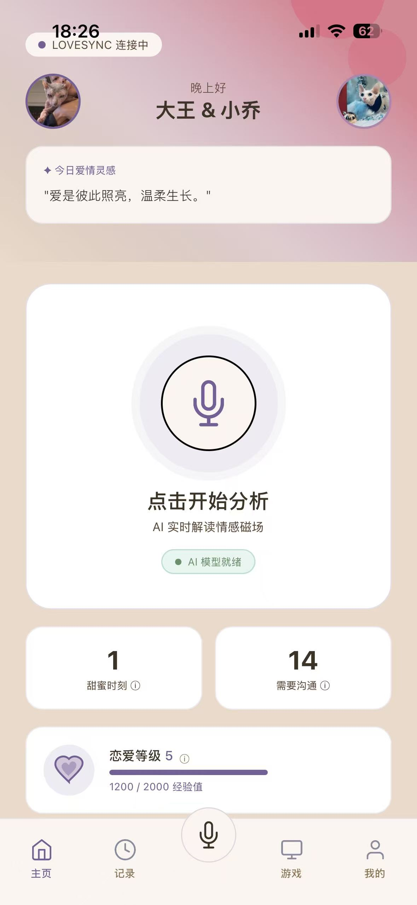
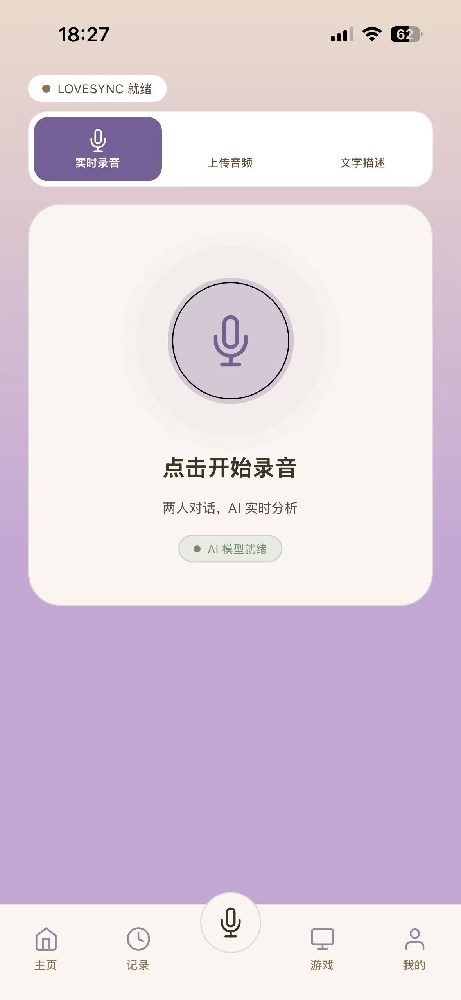
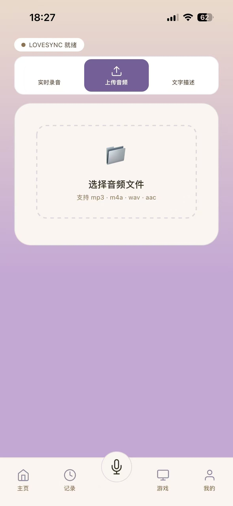
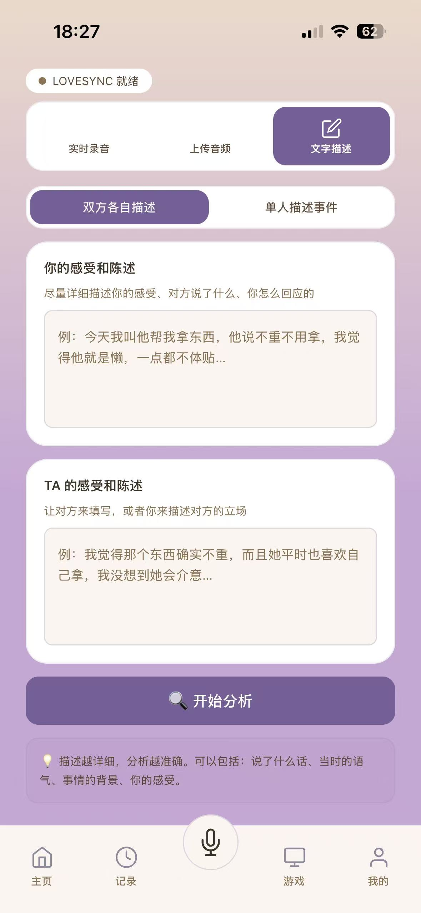
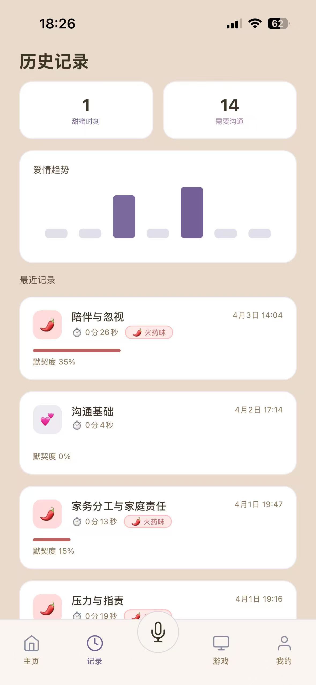
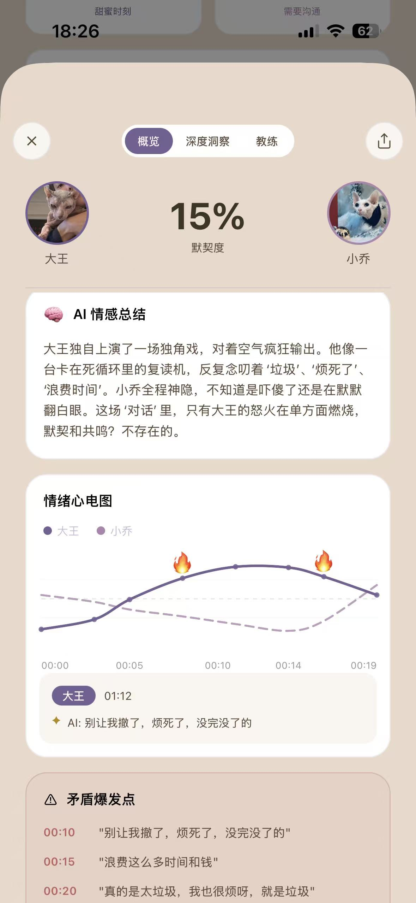
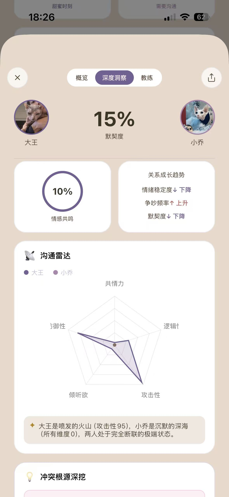
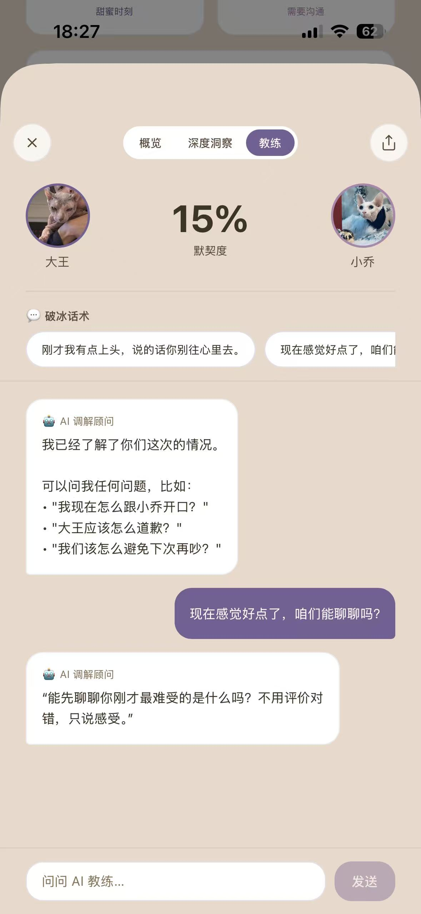
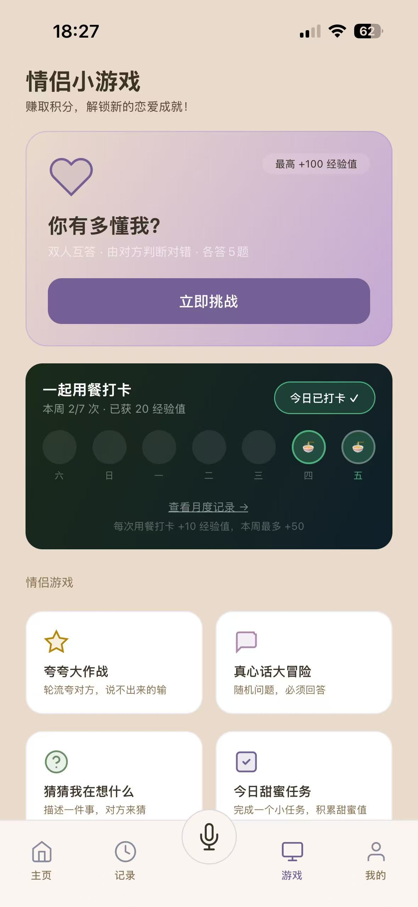
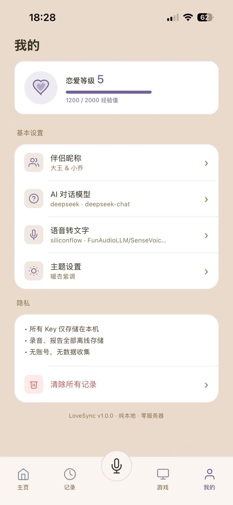

# LoveSync 💕

> 吵架后的第一个懂你的，是 AI。
> *After every fight, the first one to understand you is AI.*

**中文版** | [English Version](#english-version)

LoveSync 是专为情侣设计的 AI 关系调解助手。录下你们的对话，或直接文字描述，AI 从第三方视角分析情绪走势、找出冲突根源，并给出具体可用的破冰话术。

---

## 功能特性

### 三种输入方式
- 🎙️ **实时录音** — 两人对话直接录制，AI 实时转写并分析
- 📁 **上传音频** — 支持 mp3 / m4a / wav，导入已录好的音频
- ✍️ **文字描述** — 双方各自描述感受，或单人陈述事件经过，AI 中立分析

### 分析报告
- 📊 **情绪心电图** — 可视化两人情绪波动走势，🔥 标记爆发点
- 🧠 **AI 情感总结** — 第三方视角幽默解读这场对话
- 📡 **沟通雷达图** — 共情力、逻辑性、攻击性、防御性、倾听欲五维分析
- 🔍 **主要问题方** — 指出这次冲突谁需要反思
- 🕊️ **调解建议** — 具体可操作的和解步骤
- 💬 **AI 教练** — 生成破冰话术，支持追问「我现在怎么开口」「怎么道歉」等

### 情侣游戏

**基础游戏（无需解锁）**
- 💑 **你有多懂我** — 双人互答，由对方判断对错，考验默契
- ⭐ **夸夸大作战** — 轮流夸对方，说不出来的输
- 💬 **真心话大冒险** — 随机问题，必须诚实回答
- 🔮 **猜猜我在想什么** — 描述一件事，对方来猜

**解锁游戏（等级解锁）**
- 📋 今日甜蜜任务（Lv5）— 完成小任务，积累甜蜜值
- 🔄 角色互换（Lv10）— 用对方的视角说话，换位思考
- 💝 感恩日记（Lv15）— 说出藏在心里的谢谢
- 💡 创意提问（Lv20）— AI 出奇怪又有趣的问题
- 📷 甜蜜记忆（Lv25）— 考验你们的共同回忆
- ✨ 愿望清单（Lv30）— 说出你们的共同愿望

### 其他功能
- 📈 **爱情趋势图** — 每周记录统计，柱形图可视化
- 💝 **恋爱等级系统** — 分析和游戏均可获得经验值，解锁更多游戏
- 👫 **自定义头像昵称** — 设置双方头像和称呼
- 🍽️ **用餐打卡** — 记录一起吃饭的日子，累计甜蜜天数
- 🎯 **今日调解任务** — 基于最近对话分析，AI 生成专属任务
- 🎨 **三种主题配色** — 默认粉紫、暖杏紫调、薄荷珊瑚
- 🌸 **每日爱情灵感** — 100 条本地句子，每天一句暖心话
- 📜 **历史记录管理** — 查看所有对话记录，支持删除

---

## 主题系统

提供三种精心设计的主题配色，全应用无缝跟随：

| 主题 | 风格 | 适用场景 |
|------|------|----------|
| 🩷 默认粉紫 | 深紫渐变 + 粉紫点缀 | 原版经典，沉稳浪漫 |
| 🧡 暖杏紫调 | 杏色背景 + 紫色渐变 | 温暖柔和，适合日常 |
| 💚 薄荷珊瑚 | 薄荷清新 + 珊瑚点缀 | 清新明亮，活力满满 |

**主题覆盖范围：**
- 所有页面（首页、游戏、我的、报告详情）
- 设置弹窗（伴侣昵称、AI 模型、语音转文字）
- 首页卡片（甜蜜时刻、需要沟通、恋爱等级）
- 游戏卡片（主卡片渐变、锁图标适配）
- 图表组件（情绪心电图、沟通雷达图）
- 确认弹窗

---

## 隐私说明

| 项目 | 说明 |
|------|------|
| 数据存储 | 全部本地，不上传任何服务器 |
| 账号系统 | 无，无需注册 |
| API Key | 用户自带，仅存在本机 |
| 录音文件 | 分析完成后不保留原始音频 |

---

## 技术栈

- **框架** — React Native + Expo SDK 54
- **路由** — Expo Router v6
- **主题** — React Context 动态主题系统（三种配色，全应用跟随）
- **存储** — AsyncStorage（纯本地）
- **录音** — expo-av
- **图表** — react-native-svg（自定义贝塞尔曲线 + 主题适配）
- **AI 分析** — 兼容 OpenAI 格式（支持 DeepSeek / Claude / GPT / Gemini / 通义）
- **语音转文字** — 支持 SiliconFlow / Groq / OpenAI Whisper

---

## 快速开始

### 环境要求
- Node.js 18+
- Expo Go（手机安装）

### 启动

```bash
git clone https://github.com/你的用户名/LoveSync.git
cd LoveSync
chmod +x start.sh && ./start.sh
```

首次运行会自动安装依赖（约 3-5 分钟），之后每次直接运行 `./start.sh` 即可。

### 配置 API Key

启动后进入「我的」页面：

1. **AI 对话模型**（必填）— 推荐 DeepSeek，价格低，中文效果好
   - 获取：[platform.deepseek.com](https://platform.deepseek.com)

2. **语音转文字 STT**（使用录音功能时必填）— 推荐 SiliconFlow
   - 获取：[siliconflow.cn](https://siliconflow.cn)
   - 模型：`FunAudioLLM/SenseVoiceSmall`

---

## 支持的 AI 模型

| 提供商 | 对话分析 | 语音转文字 |
|--------|----------|------------|
| DeepSeek | ✅ 推荐 | ❌ |
| SiliconFlow | ✅ | ✅ 推荐 |
| OpenAI | ✅ | ✅ |
| Anthropic Claude | ✅ | ❌ |
| Google Gemini | ✅ | ❌ |
| 通义千问 | ✅ | ❌ |
| Groq | ✅ | ✅ |
| 自定义 | ✅ | ✅ |

---

## 截图预览

| 主页 | 录音 | 上传 | 文字描述 |
|:---:|:---:|:---:|:---:|
|  |  |  |  |

| 历史记录 | 报告概览 | 沟通雷达图 | AI 教练 |
|:---:|:---:|:---:|:---:|
|  |  |  |  |

| 游戏 | 设置 |
|:---:|:---:|
|  |  |

---

## 路线图

- [ ] 后端服务（移除自带 Key 限制，支持订阅制）
- [ ] 周 / 月关系成长报告
- [ ] AI 每日情感任务
- [ ] 聊天记录截图分析
- [ ] iOS / Android 正式上架

---

## English Version

# LoveSync 💕

> After every fight, the first one to understand you is AI.

LoveSync is an AI relationship mediator designed for couples. Record your conversations or describe them in text, and AI analyzes the emotional flow from a neutral perspective, identifies conflict roots, and provides actionable ice-breaking phrases.

---

## Features

### Three Input Methods
- 🎙️ **Real-time Recording** — Record conversations directly, AI transcribes and analyzes in real-time
- 📁 **Audio Upload** — Support mp3 / m4a / wav, import pre-recorded audio
- ✍️ **Text Description** — Both parties describe their feelings, or one person narrates the event, AI analyzes neutrally

### Analysis Report
- 📊 **Emotion ECG** — Visualize emotional fluctuations of both parties, 🔥 marks explosion points
- 🧠 **AI Emotional Summary** — Third-party perspective humorous interpretation of the conversation
- 📡 **Communication Radar** — 5-dimensional analysis: empathy, logic, aggression, defensiveness, listening
- 🔍 **Main Problem Party** — Points out who needs to reflect in this conflict
- 🕊️ **Mediation Suggestions** — Concrete actionable reconciliation steps
- 💬 **AI Coach** — Generate ice-breaking phrases, supports follow-up questions like "How should I start?", "How to apologize?"

### Couple Games

**Basic Games (No Unlock Required)**
- 💑 **How Well Do You Know Me** — Two-player quiz, partner judges answers, tests chemistry
- ⭐ **Compliment Battle** — Take turns complimenting each other, lose if you can't continue
- 💬 **Truth or Dare** — Random questions, must answer honestly
- 🔮 **Guess What I'm Thinking** — Describe something, partner guesses

**Unlockable Games (Level-based)**
- 📋 Daily Sweet Task (Lv5) — Complete small tasks, accumulate sweetness points
- 🔄 Role Swap (Lv10) — Speak from your partner's perspective, practice empathy
- 💝 Gratitude Diary (Lv15) — Express hidden thanks
- 💡 Creative Questions (Lv20) — AI generates quirky and fun questions
- 📷 Sweet Memories (Lv25) — Test your shared memories
- ✨ Wish List (Lv30) — Share your shared wishes

### Other Features
- 📈 **Love Trend Chart** — Weekly record statistics, bar chart visualization
- 💝 **Love Level System** — Gain XP from analysis and games, unlock more games
- 👫 **Custom Avatars & Nicknames** — Set avatars and names for both parties
- 🍽️ **Meal Check-in** — Record dining dates, accumulate sweet days
- 🎯 **Daily Mediation Tasks** — AI generates personalized tasks based on recent conversations
- 🎨 **Three Theme Colors** — Default Pink-Purple, Warm Apricot, Mint Coral
- 🌸 **Daily Love Inspiration** — 100 local sentences, one warm quote per day
- 📜 **History Management** — View all conversation records, supports deletion

---

## Theme System

Three carefully designed color themes, seamlessly applied across the app:

| Theme | Style | Best For |
|------|------|----------|
| 🩷 Default Pink-Purple | Deep purple gradient + pink accents | Original classic, romantic & calm |
| 🧡 Warm Apricot | Apricot background + purple gradient | Warm & soft, perfect for daily use |
| 💚 Mint Coral | Mint fresh + coral accents | Bright & fresh, energetic vibe |

**Theme Coverage:**
- All pages (Home, Games, Profile, Report Details)
- Settings drawers (Partner Nicknames, AI Model, Speech-to-Text)
- Home cards (Sweet Moments, Need Communication, Love Level)
- Game cards (Main card gradient, lock icon adaptation)
- Chart components (Emotion ECG, Communication Radar)
- Confirmation dialogs

---

## Privacy

| Item | Description |
|------|------|
| Data Storage | All local, no server uploads |
| Account System | None, no registration required |
| API Key | User-provided, stored only locally |
| Audio Files | Original audio not retained after analysis |

---

## Tech Stack

- **Framework** — React Native + Expo SDK 54
- **Routing** — Expo Router v6
- **Theme** — React Context dynamic theme system (3 colors, full app coverage)
- **Storage** — AsyncStorage (purely local)
- **Recording** — expo-av
- **Charts** — react-native-svg (custom Bézier curves + theme adaptation)
- **AI Analysis** — OpenAI-format compatible (DeepSeek / Claude / GPT / Gemini / Tongyi)
- **Speech-to-Text** — SiliconFlow / Groq / OpenAI Whisper supported

---

## Quick Start

### Requirements
- Node.js 18+
- Expo Go (installed on phone)

### Launch

```bash
git clone https://github.com/yourusername/LoveSync.git
cd LoveSync
chmod +x start.sh && ./start.sh
```

First run auto-installs dependencies (3-5 min), then just run `./start.sh` each time.

### Configure API Key

After launching, go to "Profile" page:

1. **AI Chat Model** (Required) — Recommended: DeepSeek, great Chinese support
   - Get at: [platform.deepseek.com](https://platform.deepseek.com)

2. **Speech-to-Text STT** (Required for recording) — Recommended: SiliconFlow
   - Get at: [siliconflow.cn](https://siliconflow.cn)
   - Model: `FunAudioLLM/SenseVoiceSmall`

---

## Supported AI Models

| Provider | Chat Analysis | Speech-to-Text |
|--------|----------|------------|
| DeepSeek | ✅ Recommended | ❌ |
| SiliconFlow | ✅ | ✅ Recommended |
| OpenAI | ✅ | ✅ |
| Anthropic Claude | ✅ | ❌ |
| Google Gemini | ✅ | ❌ |
| Tongyi Qianwen | ✅ | ❌ |
| Groq | ✅ | ✅ |
| Custom | ✅ | ✅ |

---

## Screenshots

| Home | Record | Upload | Text |
|:---:|:---:|:---:|:---:|
|  |  |  |  |

| History | Report | Radar | AI Coach |
|:---:|:---:|:---:|:---:|
|  |  |  |  |

| Games | Settings |
|:---:|:---:|
|  |  |

---

## Roadmap

- [ ] Backend service (remove self-provided Key limit, support subscription)
- [ ] Weekly / Monthly relationship growth report
- [ ] AI daily emotional tasks
- [ ] Chat screenshot analysis
- [ ] iOS / Android official release

---

## License

Copyright © 2025 LoveSync. All Rights Reserved.

Unauthorized commercial use of this project is prohibited.

---

## Disclaimer

> 🤖 **本应用纯属 Vibe Coding 产物，全程由 AI 伴随开发完成。**
> **This app is purely a Vibe Coding creation, developed entirely with AI assistance.**
>
> 如有任何设计、功能或创意与他人作品相似或雷同，纯属 AI 脑洞出奇，绝非有意抄袭。
> If any design, functionality, or creative elements resemble or duplicate others' work, it is purely AI's unexpected brainstorming, absolutely not intentional plagiarism.
>
> 如有侵权，请联系作者删除或调整。
> If there's any infringement, please contact the author for removal or adjustment.

---

<div align="center">
  <sub>为所有在鸡毛蒜皮中相爱的人而建 · Built for couples who love each other through the little things</sub>
</div>